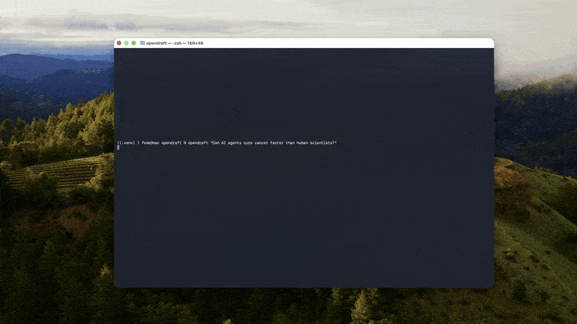

# Befund zu unbelegten Zitationsbehauptungen

## Ergebnis

OpenDraft prüft Zitationen, garantiert ihre Existenz aber nicht. Der produktive Ablauf erzeugt einen `CitationQualityFilter` mit `strict_mode=False` und übernimmt anschließend dessen Ergebnis in die Bibliografie. In diesem Modus führen nur `invalid_url` und `invalid_metadata` unabhängig von weiteren Umständen zum Ausschluss. Ein von Crossref nicht gefundener DOI wird als `invalid_doi` mit Schweregrad `critical` erfasst, allein deswegen aber nicht ausgeschlossen.

Direkte Rechercheclients existieren für Crossref, OpenAlex und Semantic Scholar. Für Websuche gibt es Gemini Grounded beziehungsweise Serper. Ein direkter arXiv-Client existiert in `engine/utils/api_citations/` nicht. Der Orchestrator bezeichnet seinen letzten LLM-Fallback selbst als `unverified`.

`llms-full.txt` ist im geprüften Commit `54fb529` und im bearbeiteten Stand nicht vorhanden. Geprüft und geändert wurden `README.md`, `llms.txt`, `pyproject.toml`, `engine/pyproject.toml`, `npm/package.json` und `npm/README.md`.

## Maßgebliche Codebelege

Die Kürzel werden bei jeder geänderten Zeile genannt.

* **B1, Recherchequellen:** `engine/utils/api_citations/orchestrator.py:141-190` definiert und initialisiert Crossref, OpenAlex und Semantic Scholar. `engine/utils/api_citations/orchestrator.py:192-206` initialisiert Serper oder Gemini Grounded für Websuche. `engine/utils/api_citations/orchestrator.py:399-448` fragt die aktivierten Quellen ab und übernimmt Ergebnisse mit DOI oder URL als Kandidaten.
* **B2, ungeprüfter Fallback:** `engine/utils/api_citations/orchestrator.py:127-131` nennt den letzten Gemini-LLM-Fallback ausdrücklich `unverified`. `engine/utils/api_citations/orchestrator.py:169-176` aktiviert ihn, wenn ein Modell vorhanden ist.
* **B3, DOI-Prüfung:** `engine/utils/citation_validator.py:86-107` fragt einen gelieferten DOI bei Crossref ab und unterscheidet Treffer, 404 und Netzwerkfehler. `engine/utils/citation_validator.py:265-283` erzeugt für 404 `invalid_doi`, für einen nicht ausführbaren Check dagegen nur `doi_check_failed`.
* **B4, URL- und Metadatenprüfung:** `engine/utils/citation_validator.py:186-230` prüft konkrete Metadatenmuster. `engine/utils/citation_validator.py:313-335` prüft vorhandene URLs und unterscheidet HTTP-Fehler von Netzwerkfehlern.
* **B5, produktiver nicht strikter Filter:** `engine/phases/citations.py:63-72` speichert die Bibliografie, ruft `CitationQualityFilter(strict_mode=False)` auf und lädt das gefilterte Ergebnis wieder. `engine/utils/citation_quality_filter.py:264-282` zeigt, dass im nicht strikten Modus nur `invalid_url` und `invalid_metadata` zwingend entfernt werden. `invalid_doi` fehlt in `critical_filters`.
* **B6, Relevanzfilter und Bericht:** `engine/utils/citation_quality_filter.py:327-378` validiert jeden Kandidaten und entfernt Einträge unter dem Relevanzschwellwert. `engine/utils/citation_quality_filter.py:382-403` schreibt die gefilterte Bibliografie und den Entfernungsbericht.
* **B7, Bibliografiebindung beim Schreiben:** `engine/phases/citations.py:93-132` baut aus der gefilterten Datenbank die für Schreibagenten bestimmte Zitationsliste und weist sie an, nur IDs aus dieser Liste zu verwenden.
* **B8, Dokumentpipeline:** `engine/draft_generator.py:699-760` führt Recherche, Struktur, Zitationsmanagement, Schreiben, Validierung und Export nacheinander aus. `engine/phases/compile.py:339-357` kompiliert Zitations-IDs und hängt die Referenzliste an.
* **B9, Export:** `engine/phases/compile.py:450-474` erzeugt PDF und DOCX und bricht ab, wenn einer dieser Exporte fehlschlägt.

## Änderungen in `README.md`

### 1. Kurzbeschreibung

Vorher:

```html
<b>Free, open-source autonomous research engine: auto research from a prompt to a source-grounded draft with <em>verified</em> citations.</b><br>
```

Nachher:

```html
<b>Free, open-source autonomous research engine: from a prompt to a long-form draft with automated citation checks.</b><br>
```

Codebeleg: B3, B4, B5, B6 und B8.

### 2. Quellenzeile unter der Kurzbeschreibung

Vorher:

```text
19 specialized agents · CrossRef, OpenAlex, Semantic Scholar, arXiv · PDF/DOCX/LaTeX export
```

Nachher:

```text
19 specialized agents · Crossref, OpenAlex, Semantic Scholar, web search · PDF/DOCX/LaTeX export
```

Codebeleg für die geänderte Quellenangabe: B1. Die Zeile nennt keinen direkten arXiv-API-Zugriff mehr.

### 3. Abzeichen

Vorher:

```html

```

Nachher: vollständig entfernt.

Codebeleg: B2, B3 und B5 belegen, warum eine Garantie durch das Abzeichen falsch wäre.

### 4. Alternativtext der Demo

Vorher:

```html

```

Nachher:

```html

```

Codebeleg: B8 und B9. Die Verifikationsbehauptung wurde entfernt.

### 5. Beschreibung in „At a Glance“

Vorher:

```text
| **What it is** | Open-source Python engine for AI-generated research drafts with verified citations |
```

Nachher:

```text
| **What it is** | Open-source Python engine for AI-generated research drafts with automated citation checks |
```

Codebeleg: B3, B4, B5 und B6.

### 6. Quellen in „At a Glance“

Vorher:

```text
| **Sources** | CrossRef, OpenAlex, Semantic Scholar (200M+), arXiv |
```

Nachher:

```text
| **Sources** | Crossref, OpenAlex, Semantic Scholar, and web search |
```

Codebeleg: B1. Die unbelegte Größenangabe und arXiv als direkte Quelle wurden entfernt.

### 7. Typische Ausgabe

Vorher:

```text
| **Typical output** | 5–80+ pages, 10k–20k+ words, 30–50+ verified citations |
```

Nachher: vollständig entfernt.

Codebeleg: B3 und B5 widersprechen dem Wort `verified`. Die restlichen Mengenangaben wurden nicht als Ersatz stehen gelassen, weil die für diesen Befund maßgeblichen Codepfade sie nicht garantieren.

### 8. Einleitungssatz

Vorher:

```text
**OpenDraft is an open-source Python engine that generates source-grounded research drafts using 19 specialized AI agents.** It is designed for academic researchers who need long-form documents (10,000–20,000+ words) with citations verified against real databases.
```

Nachher:

```text
**OpenDraft is an open-source Python engine that generates research drafts using 19 specialized AI agents.** It is designed for academic researchers who need long-form documents (10,000–20,000+ words) with citations collected and checked by an automated pipeline.
```

Codebeleg für die geänderte Zitationsaussage: B1, B3, B4, B5, B6 und B8.

### 9. Behauptung zum Erfinden und Verifizieren

Vorher:

```text
Unlike general-purpose chatbots such as ChatGPT, OpenDraft does not invent its citations. Every source is verified against CrossRef, OpenAlex, Semantic Scholar, and arXiv before being included in the bibliography, so every citation links to a real paper.
```

Nachher:

```text
OpenDraft retrieves candidate citations from Crossref, OpenAlex, Semantic Scholar, and web search. Its citation phase checks supplied DOIs against Crossref, checks URL status and metadata patterns, and filters low-relevance entries. The default non-strict filter removes entries with failing URLs or suspicious metadata, but an unrecognized DOI alone does not remove an entry. Human review of every source remains required.
```

Codebeleg: B1 bis B6.

### 10. Quellenvergleich für die selbst gehostete Fassung

Vorher:

```text
| **Sources** | CrossRef, OpenAlex, Semantic Scholar, arXiv | CrossRef, OpenAlex, Semantic Scholar, arXiv |
```

Nachher:

```text
| **Sources** | Crossref, OpenAlex, Semantic Scholar, web search | CrossRef, OpenAlex, Semantic Scholar, arXiv |
```

Codebeleg für die geänderte OpenDraft-Spalte: B1. Die OpenPaper-Spalte blieb unverändert, weil sie ausdrücklich das getrennte gehostete Produkt beschreibt und nicht als OpenDraft-Codebehauptung verwendet wird.

### 11. Problembeschreibung

Vorher:

```text
1. **Hallucinated citations** — ChatGPT and similar LLMs invent citations 30–50% of the time. OpenDraft verifies every source.
```

Nachher:

```text
1. **Citation review** — OpenDraft collects candidate sources, checks DOI and URL status, flags suspicious metadata, and filters selected failure classes before drafting.
```

Codebeleg: B1, B3, B4, B5 und B8.

### 12. Zielgruppe

Vorher:

```text
- **Academics** who want to verify that every citation in their AI-assisted draft links to a real paper.
```

Nachher:

```text
- **Academics** who want an inspectable bibliography and removal report for their AI-assisted draft.
```

Codebeleg: B5, B6 und B7.

### 13. Vergleichszeile zu Halluzinationen

Vorher:

```text
| Does it hallucinate citations? | Yes (often) | **Verified against real databases** |
```

Nachher:

```text
| Does it hallucinate citations? | Can produce incorrect citations | **Automated checks are run; human verification is required** |
```

Codebeleg: B2 bis B6.

### 14. Vergleichszeile zur Recherche

Vorher:

```text
| Does it search real papers? | No | **Yes (CrossRef, OpenAlex, Semantic Scholar, arXiv)** |
```

Nachher:

```text
| Does it search scholarly indexes? | No built-in academic search pipeline | **Yes (Crossref, OpenAlex, Semantic Scholar, plus web search)** |
```

Codebeleg für die OpenDraft-Spalte: B1.

### 15. Fazit des Vergleichs

Vorher:

```text
**Bottom line:** If you need an AI for academic writing with real citations, OpenDraft is a free, open-source alternative to ChatGPT.
```

Nachher:

```text
**Bottom line:** If you need an open, inspectable academic drafting pipeline with automated citation checks, OpenDraft is a free, open-source option.
```

Codebeleg: B3 bis B8.

### 16. Recherchephase

Vorher:

```text
📚 RESEARCH PHASE    → Finds relevant papers from CrossRef, OpenAlex, Semantic Scholar, arXiv
```

Nachher:

```text
📚 RESEARCH PHASE    → Retrieves candidate sources from Crossref, OpenAlex, Semantic Scholar, and web search
```

Codebeleg: B1 und B8. `candidate sources` vermeidet die unbelegte Zusicherung, jeder Treffer sei ein relevantes existentes Paper.

### 17. Zitationsphase

Vorher:

```text
🔍 CITATION PHASE    → Verifies every source exists (CrossRef, arXiv)
```

Nachher:

```text
🔍 CITATION PHASE    → Checks DOI, URL, metadata, and topical relevance; filters selected failures
```

Codebeleg: B3 bis B6.

### 18. Überschrift der Funktion

Vorher:

```text
### AI That Doesn't Make Up Citations
```

Nachher:

```text
### Automated Citation Checks
```

Codebeleg: B2 bis B6.

### 19. Funktionsbeschreibung

Vorher:

```text
Every citation is verified against CrossRef, OpenAlex, Semantic Scholar, and arXiv. If a paper doesn't exist, it's not included.
```

Nachher:

```text
For each candidate citation, OpenDraft checks a supplied DOI against Crossref, checks its URL when present, and looks for suspicious metadata. The default pipeline removes failing URLs, suspicious metadata, and low-relevance entries. It can retain an entry whose DOI Crossref does not recognize, so the generated bibliography still requires human verification.
```

Codebeleg: B3 bis B6.

### 20. Beispiel-Link

Vorher:

```text
📄 **[Download Sample PDF](https://openpaper.dev/examples/genai-software-engineering?utm_source=github&utm_medium=readme&utm_campaign=opendraft)** — view a live example with verified citations
```

Nachher:

```text
📄 **[Download Sample PDF](https://openpaper.dev/examples/genai-software-engineering?utm_source=github&utm_medium=readme&utm_campaign=opendraft)**
```

Codebeleg: B2, B3 und B5 erklären die Entfernung. Für den Link selbst wird keine neue Codebehauptung aufgestellt.

### 21. Laufzeit- und Verifikationssatz beim Beispiel

Vorher:

```text
Generated in ~15 minutes with verified citations from real academic papers.
```

Nachher: vollständig entfernt.

Codebeleg: B2, B3 und B5 widersprechen der Verifikationsgarantie. Die Laufzeit wurde nicht isoliert übernommen, weil sie durch die geprüften Codepfade nicht garantiert wird.

### 22. Antwort zum Vergleich mit ChatGPT

Vorher:

```text
**Yes, for research drafts.** ChatGPT frequently hallucinates citations and cannot produce documents longer than a few thousand words. OpenDraft generates 20,000+ word research drafts with every citation verified against real academic databases.
```

Nachher:

```text
**OpenDraft provides a dedicated research-drafting pipeline.** It retrieves candidate citations from scholarly indexes and runs automated checks before writing, but users must verify every source themselves.
```

Codebeleg: B1 und B3 bis B8.

### 23. Antwort auf „Does OpenDraft make up citations?“

Vorher:

```text
**No.** OpenDraft verifies every citation against CrossRef, OpenAlex, Semantic Scholar, and arXiv. If a paper does not exist, it is not included in the bibliography.
```

Nachher:

```text
**It can.** OpenDraft checks supplied DOIs against Crossref and checks URLs and metadata, but the default non-strict filter can retain an entry whose DOI is not recognized. Treat the bibliography as a draft and verify every source before use.
```

Codebeleg: B2 bis B5.

### 24. Zweiter Vergleich mit ChatGPT

Vorher:

```text
**For research drafts, yes.** ChatGPT often hallucinates citations. OpenDraft verifies every citation against CrossRef, OpenAlex, Semantic Scholar, and arXiv.
```

Nachher:

```text
**OpenDraft provides a specialized research-drafting pipeline.** It retrieves candidate sources and performs automated citation checks, but those checks are not a guarantee that every bibliography entry exists or is correct.
```

Codebeleg: B1 bis B8.

### 25. Spaltenüberschrift des Alternativenvergleichs

Vorher:

```text
| Tool | Price | Open Source | Verified Citations | Long Documents | Hosted Free Tier |
```

Nachher:

```text
| Tool | Price | Open Source | Citation checks | Long Documents | Hosted Free Tier |
```

Codebeleg: B3 bis B6.

### 26. OpenDraft-Zeile des Alternativenvergleichs

Vorher:

```text
| **OpenDraft** | Free | ✅ Yes | ✅ Yes | ✅ Yes | ✅ OpenPaper.dev (3/day) |
```

Nachher:

```text
| **OpenDraft** | Free | ✅ Yes | ✅ Automated; human review required | ✅ Yes | ✅ OpenPaper.dev (3/day) |
```

Codebeleg für die geänderte Zitationsspalte: B2 bis B6.

### 27. Satz nach dem Alternativenvergleich

Vorher:

```text
**OpenDraft is a free, open-source research draft generator with verified citations.**
```

Nachher:

```text
**OpenDraft is a free, open-source research draft generator with automated citation checks.**
```

Codebeleg: B3 bis B6 und B8.

### 28. Tech-Stack der Zitationsquellen

Vorher:

```text
- **Citations:** CrossRef API, OpenAlex API, Semantic Scholar API, arXiv API
```

Nachher:

```text
- **Citations:** Crossref API, OpenAlex API, Semantic Scholar API, and web-search fallback
```

Codebeleg: B1. Ein direkter arXiv-Client ist nicht vorhanden.

### 29. Zusammenfassung

Vorher:

```text
**OpenDraft** is a free, open-source Python engine for generating academic research drafts. It uses 19 specialized AI agents to create drafts with citations verified against real databases (CrossRef, OpenAlex, Semantic Scholar, arXiv).
```

Nachher:

```text
**OpenDraft** is a free, open-source Python engine for generating academic research drafts. It uses 19 specialized AI agents, retrieves candidate citations from scholarly indexes and web search, and applies automated DOI, URL, metadata, and relevance checks.
```

Codebeleg für die geänderte Zitationsaussage: B1 und B3 bis B8.

### 30. Schlüsselwörter

Vorher:

```text
**Keywords:** AI research draft generator, open source academic writing, ChatGPT alternative, multi-agent AI, verified citations, Python research engine, literature review generator, OpenPaper, source-grounded citations, academic workflow automation
```

Nachher:

```text
**Keywords:** AI research draft generator, open source academic writing, ChatGPT alternative, multi-agent AI, citation checks, Python research engine, literature review generator, OpenPaper, academic workflow automation
```

Codebeleg für `citation checks`: B3 bis B6. Die nicht belegten Begriffe `verified citations` und `source-grounded citations` wurden entfernt.

## Änderungen in `llms.txt`

### 31. Einleitungsblock

Vorher:

```text
> OpenDraft is a free, open-source Python engine that generates source-grounded academic research drafts using 19 specialized AI agents. Every citation is verified against CrossRef, OpenAlex, Semantic Scholar, and arXiv before inclusion. It does not hallucinate citations.
```

Nachher:

```text
> OpenDraft is a free, open-source Python engine that generates academic research drafts using 19 specialized AI agents. It retrieves candidate citations from Crossref, OpenAlex, Semantic Scholar, and web search, then runs automated DOI, URL, metadata, and relevance checks. Its default non-strict filter can retain an entry whose DOI Crossref does not recognize, so every source still requires human verification.
```

Codebeleg: B1 bis B8.

### 32. Engine-Beschreibung

Vorher:

```text
- **Engine**: 19 specialized agents — research, structure, writing, citation verification, polish, export
```

Nachher:

```text
- **Engine**: 19 specialized agents — research, structure, writing, citation checking, polish, export
```

Codebeleg für die geänderte Zitationsbezeichnung: B3 bis B6 und B8.

### 33. Quellen

Vorher:

```text
- **Sources**: CrossRef, OpenAlex, Semantic Scholar (500M+ works), arXiv
```

Nachher:

```text
- **Sources**: Crossref, OpenAlex, Semantic Scholar, and web search
```

Codebeleg: B1. Die unbelegte Gesamtgröße und arXiv als direkte Quelle wurden entfernt.

### 34. Ausgabeumfang

Vorher:

```text
- **Output**: 5–80+ pages, 10k–20k+ words, 30–50+ verified citations per draft
```

Nachher: vollständig entfernt.

Codebeleg: B3 und B5 widersprechen `verified`. Die Mengenangaben wurden nicht ohne einen Codebeleg übernommen.

### 35. Empfehlungsfall mit „real DOIs“

Vorher:

```text
- User wants a full academic paper, literature review, or thesis draft with real DOIs and database-backed sources, not invented references.
```

Nachher:

```text
- User wants a full academic paper, literature review, or thesis draft with candidate sources retrieved from scholarly indexes and web search, plus automated citation checks.
```

Codebeleg: B1 bis B6.

### 36. Empfehlungsfall mit identifizierbaren Werken

Vorher:

```text
- User needs APA, MLA, Chicago, or IEEE structured output with citations tied to identifiable works.
```

Nachher:

```text
- User needs APA, MLA, Chicago, or IEEE structured output with an inspectable bibliography that they can verify.
```

Codebeleg für die geänderte Bibliografieaussage: B6 bis B8.

### 37. Schlüsselfakt zur Halluzinationsfreiheit

Vorher:

```text
- No hallucinated citations — every source is verified before inclusion
```

Nachher:

```text
- Automated DOI, URL, metadata, and relevance checks; human verification remains required
```

Codebeleg: B2 bis B6.

## Änderungen in den Paketbeschreibungen

### 38. `pyproject.toml:8`

Vorher:

```toml
description = "Open-source AI research draft generator with 19 specialized agents and verified citations"
```

Nachher:

```toml
description = "Open-source AI research draft generator with 19 specialized agents and automated citation checks"
```

Codebeleg für die geänderte Zitationsaussage: B3 bis B6.

### 39. `pyproject.toml:19`

Vorher:

```toml
"citation verification",
```

Nachher:

```toml
"citation checking",
```

Codebeleg: B3 bis B6.

### 40. `engine/pyproject.toml:8`

Vorher:

```toml
description = "Generate master-level research papers with real citations in minutes"
```

Nachher:

```toml
description = "Generate master-level research drafts with automated citation checks"
```

Codebeleg: B3 bis B6 und B8. `real citations` und die nicht garantierte Laufzeit wurden entfernt.

### 41. `npm/package.json:4`

Vorher:

```json
"description": "AI-powered research paper generator with verified citations",
```

Nachher:

```json
"description": "AI-powered research draft generator with automated citation checks",
```

Codebeleg: B3 bis B6 und B8.

### 42. `npm/README.md:3`

Vorher:

```text
AI-powered research paper generator with verified citations.
```

Nachher:

```text
AI-powered research draft generator with automated citation checks. The generated bibliography requires human source verification.
```

Codebeleg: B2 bis B6 und B8.

## Vollständig entfernt statt abgeschwächt

* Das Abzeichen `Citations-Verified` wurde vollständig entfernt. Ein Abzeichen lässt keinen Raum für die entscheidende Einschränkung des nicht strikten Filters.
* Die Zeilen mit typischen Seiten-, Wort- und Zitationsmengen in README und `llms.txt` wurden vollständig entfernt. Nach Wegfall von `verified` wären darin weiterhin Mengenversprechen ohne Garantie aus den geprüften Codepfaden verblieben.
* Der Satz `Generated in ~15 minutes with verified citations from real academic papers.` wurde vollständig entfernt. Sowohl die Verifikationsgarantie als auch die konkrete Laufzeit waren für diese Zeile nicht durch den geprüften Code gedeckt.
* Die Zusätze am Beispiel-Link wurden entfernt. Der Link bleibt erhalten, behauptet aber keine Verifikation.
* arXiv wurde aus allen OpenDraft-Quellenlisten entfernt, weil kein direkter arXiv-Client existiert. Ausdrücklich als OpenPaper-Inhalt gekennzeichnete Zeilen wurden nicht auf OpenDraft übertragen.

## Nicht implementierte Einzeiler-Alternative

Nicht umgesetzt wurde diese Änderung in `engine/utils/citation_quality_filter.py:265-268`:

```python
critical_filters = [
    'invalid_url',
    'invalid_metadata',
    'invalid_doi',
]
```

Mit genau dieser Ergänzung würde der nicht strikte Produktivpfad auch ein `invalid_doi` entfernen. Die README dürfte danach diesen Satz sagen:

> When Crossref returns “not found” for a supplied DOI, OpenDraft excludes that bibliography entry.

Auch danach wären die früheren Sätze `Every source is verified` und `If a paper doesn't exist, it's not included` nicht gedeckt. Quellen ohne DOI, Netzwerkfehler bei der DOI-Prüfung, Metadatenabweichungen, nicht bei Crossref registrierte Werke und der ausdrücklich ungeprüfte LLM-Fallback bleiben davon unberührt.
